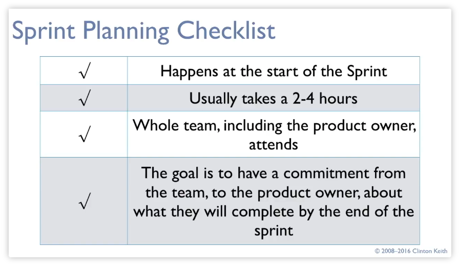
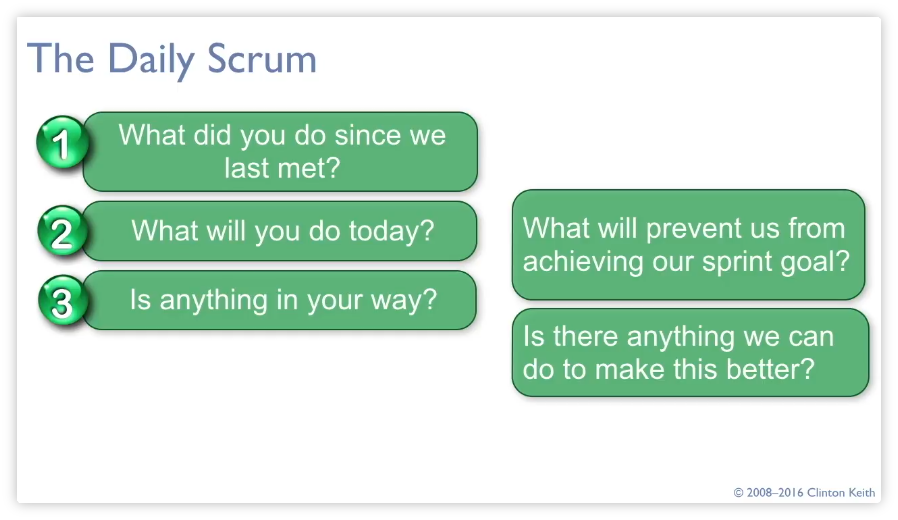
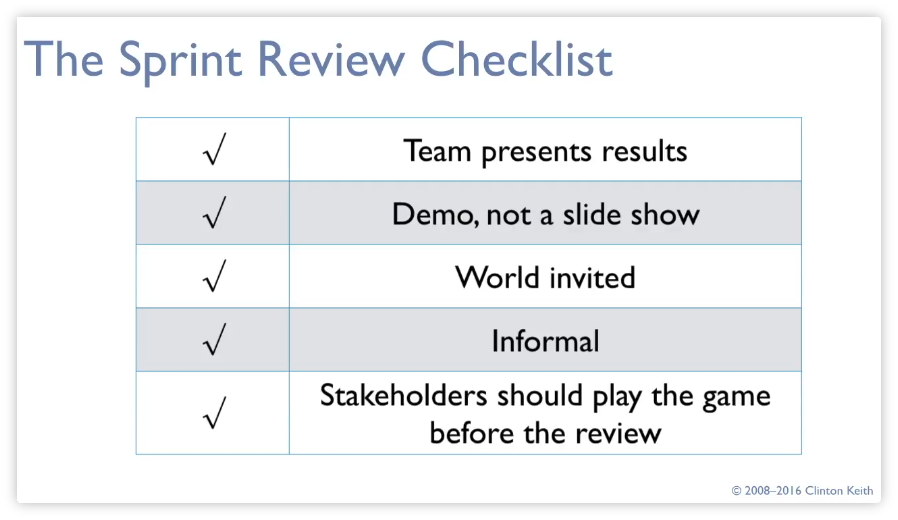
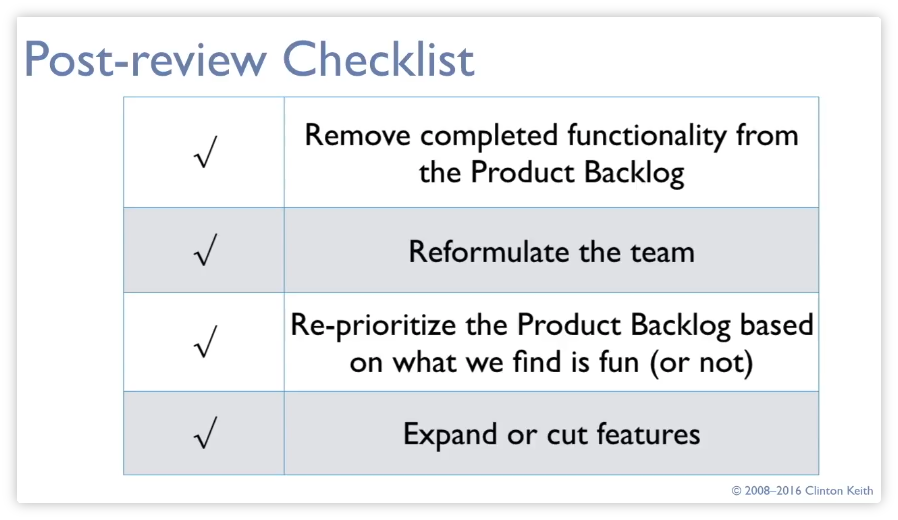
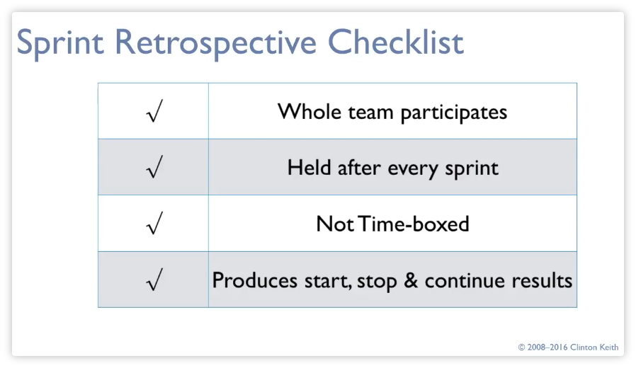

# Apuntes Agile Game Development

* Cuatro pasos fundamentales, en forma de ciclo:

    1. Discover
    2. Design
    3. Develop
    4. Test
    
* Concentrarse en el juego antes que en el plan

## SCRUM

* Se empieza con el producto, que son las cosas que se quieren meter en el juego

* Cada requisito se separa y se forma un sprint, que suele durar de una a tres semanas

* Se crea un plan por cada *sprint*

* El progreso se tiene que ver día a día

* Luego viene una reseña del *sprint* y se estudia también los problemas que han ocurrido así como qué hacer para mejorar en el siguiente *sprint*

* El *Product Backlog* está ordenado por prioridad

## Sprints

* Se tiene que hacer un demo al final de cada *sprint* 

* No se pueden atrasar los *sprints*

### Sprint cycle

Planning: Se planea lo que se tiene que hacer para el sprint

Daily Scrums: Se revisa diariamente el progreso

Review Meeting: Se revisa el resultado del sprint

Retrospective: Se mira lo qué se ha logrado y si necesitan hacerse cambios

* el *Sprint day* consiste en realizar la review, la retrospective y el planning del siguiente sprint

#### Planning Meeting

* Se seleccionan las mecánicas del *Product backlog* que se puedan completar en el *sprint*

* Se crea el *sprint backlog*

    * Diseño de la mecánica a alto nivel y con el número de horas
    
* Tiene que haber una definición de "terminado"

* El *Sprint Backlog* puede ser modificado siempre

* En la retrospective, tenemos que pensar en lñas cosas que hacer, que parar y que continuar

## Product Backlog

### User Stories

* Las user stories son una especie de requisitos con lo que se necesita y para qué

* Podemos meter requisitos dentro de una user story

* También se pueden meter stories para los desarrolladores

